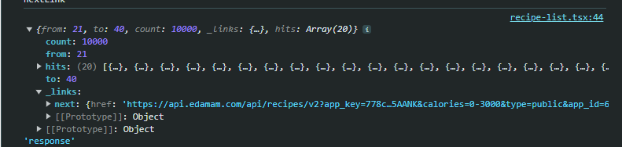
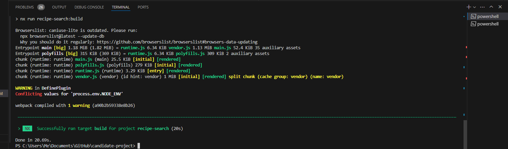

# Hyphen Candidate Project

Final Result as a gif and some issues are attached 

## Table of Contents

- [Installation](#installation)
- [Result](#result)
- [Back Button Issue](#backbutton)
- [Deploy](#deploy)

## Installation

I have added Jotai to avoid using many Context , all satates are in atoms folder in src/atoms
this is the only package that i have added 
the gif of result may load a bit slow because of 19 MB of size 

## Result

## Back Button Issue
In response there is no self , this is the attached screenshot of what the response is : 

## Deploy 
I could not deploy the project here is the attached error 
I searched a lot but i didn't find the solution 

